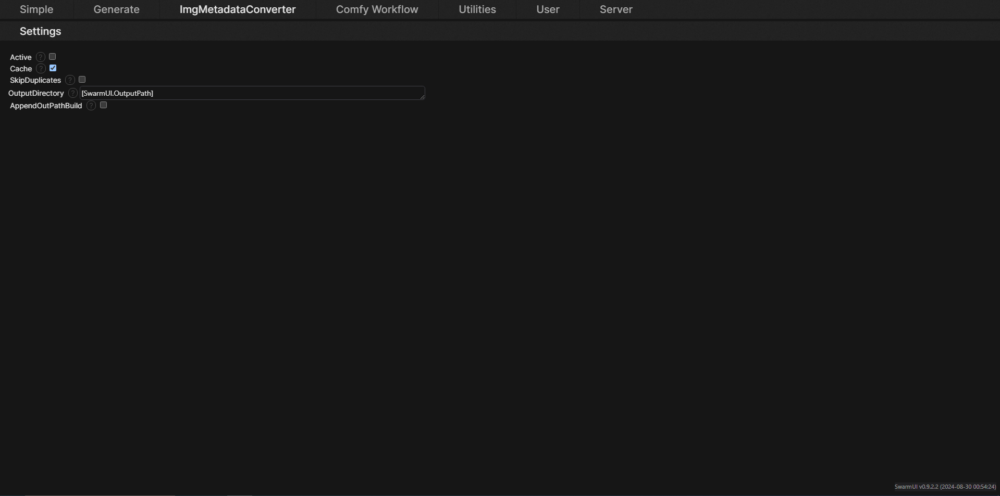

# SwarmUI-ImgMetadataConverter

A [SwarmUI](https://github.com/mcmonkeyprojects/SwarmUI) extension that allows you to save a duplicate image with metadata that looks like the one from A1111/Forge. Mainly useful for those who publish on CivitAI.

I appreciate any kind of feedback, if you have a feature request or want to report a bug you can do so in the [Issues](https://github.com/Jelosus2/ImgMetadataConverter/issues) page.

## Installation
0. Close SwarmUI if it's running.
1. Go to `(SwarmUI)/src/Extensions`
2. Open a cmd in that folder and run `git clone https://github.com/Jelosus2/ImgMetadataConverter`
3. Run `update-windows.bat` or `update-linuxmac.sh` to recompile the project.
4. Launch SwarmUI.

## Update the extension
0. Close SwarmUI if it's running.
1. Go to `(SwarmUI)/src/Extensions/ImgMetadataConverter`
2. Open a cmd in that folder and run `git pull`
3. Run `update-windows.bat` or `update-linuxmac.sh` to recompile the project.
4. Launch SwarmUI and go to the `ImgMetadataConverter` tab to apply new settings in case there's any.

## How to use it
Once SwarmUI is running you can go to the `ImgMetadataConverter` and change the options. Remember to activate the extension or else it won't work!

The images with A1111-like metadata will be saved in the **OutputDirectory**. You can use relative and absolute paths for it. If you wish to use the same directory as the one you have in **Server -> Server Configuration -> Paths** just use `[SwarmUI.OutputPath]` in the field (yes, you can append subdirectories like `[SwarmUI.OutputPath]/mysubdirectory`). If you wish to append the same directory as in **User -> User Settings -> OutPathBuilder** to the final path you can enable the `AppendOutPathBuild` option.

Once all setup is done when you generate an image it will automatically save a duplicate in the OutputPath of the extension settings. The file name would end with this: `-converted`. Unless you enable the `SkipDuplicates` option, in that case the image will be saved on the swarm's default output directory and with no `-converted` at the end but it will still have the A1111-like metadata.

# Common errors.
If you get erros related to checkpoints or loras not being found make sure your paths for them are correct in **Server -> Server Settings -> Paths**. If they are correct and you still face an issue please open an issue.